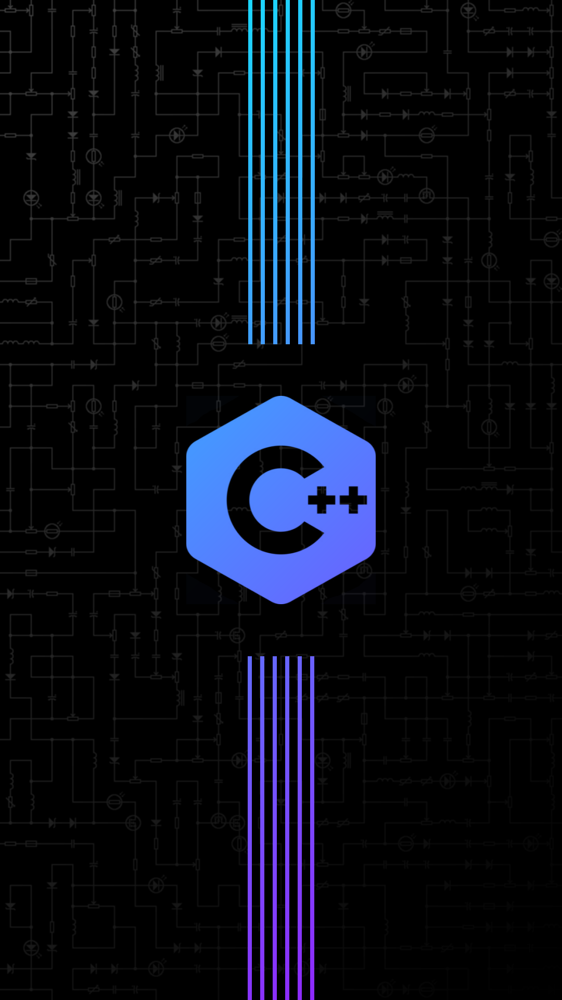
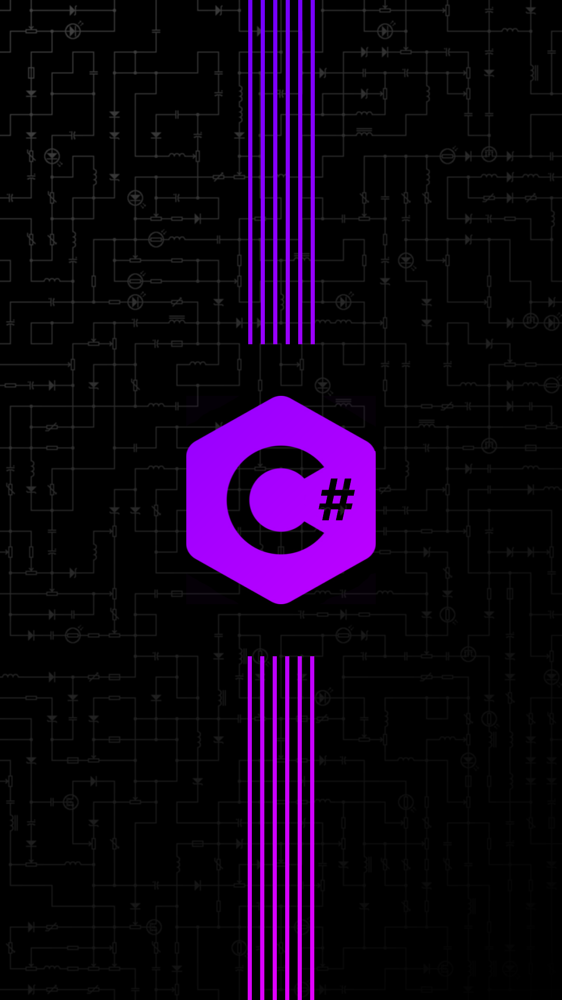

# WAVE-FUNCTION-COLLAPSE-GRADIENT-WALLPAPER-ENGINE

Fully customiseable wallpaper generator, suited for both horizontal and vertical monitors at any resolution. The (simplified) wave function collapse algorithm generates a randomised circuit schematic which can be seen in the background below (the tileset can be changed to generate a different background).

 
 

<details>
<summary>More horizontal examples</summary>
 
 
</details>

<details>
<summary>Vertical examples</summary>

  
  
 

</details>

# Settings

You may find it easiest to copy one of the existing settings .json files and modifying it.

## wallpaper_size

The final target dimension of your wallpaper, best for the dimensions to be a multiple of ```wave_function_collapse -> tile_size``` (seen later)

## background

```enabled``` set to ```true``` to use a background generator and ```false``` for a black background

```<layer>_gradient``` set to ```true``` to use a top-left to bottom-right gradient and ```false``` for a block colour

```<layer>_color_tl``` and ```<layer>_color_br``` are the two diagonal colours for the gradient. ```<layer>_color_br``` is ignored if ```<layer>_gradient``` is set to ```false```

```blur_strength``` is the sample radius of a ```BoxBlur``` (bigger is blurrier), set to ```0``` for no blur effect

The last of ```wave_function_collapse``` or ```grayscale_image``` or ```binary_image``` that are enabled will be used (only one should be enabled to avoid this issue)

### wave_function_collapse

Uses the (simplified) wave function collapse algorithm to generate a random set of tiles with valid adjacency (in this case a circuit schematic), this is then used as a mask between the top and bottom background layers.

```tile_size``` is the width and height (square) of the tiles to be used in the wave function collapse generator

```weights``` gives bias to the random selection of elements in the wave function collapse (bigger is more biased and the numbers are relative so they do not need to sum to a target value e.g. 100%)

### grayscale_image

Uses an image and converts it to greyscale and uses it as a mask between the background layers

### binary_image

Uses an image and converts it to binary with a given threshold and uses it as a mask between the background layers

```threshold``` is the average pixel brightness on the boundary of ```1``` and ```0```

## foreground

```enabled``` set to ```true``` to use the foreground generator and ```false``` for nothing

```<layer>_gradient``` set to ```true``` to use a top-left to bottom-right gradient and ```false``` for a block colour

```<layer>_mask_source``` is the directory of the corresponding mask

```<layer>_color_tl``` and ```<layer>_color_br``` are the two diagonal colours for the gradient, ```<layer>_color_br``` is ignored if ```<layer>_gradient``` is set to ```false```

```bottom_enabled``` is set to ```true``` for a pair of different gradients (top and bottom layers) and ```false``` for a single gradient across the entire foreground. ```bottom_<attributes>``` are ignored if ```bottom_enabled``` is set to false

### lines

```orientation``` can be ```"horizontal"``` or ```"vertical"``` and indicated the direction the lines should come from

```line_count``` is the number of adjacent lines

```line_spacing``` is the spacing between the line centres in pixels

```line_width``` is the width of the lines in pixels

```center_width``` is the centered width in pixels that should be left blank

## output_name

The directory of the completed image

## save_parts

Save each component of the background used to create the final image (useful for gradient matching)